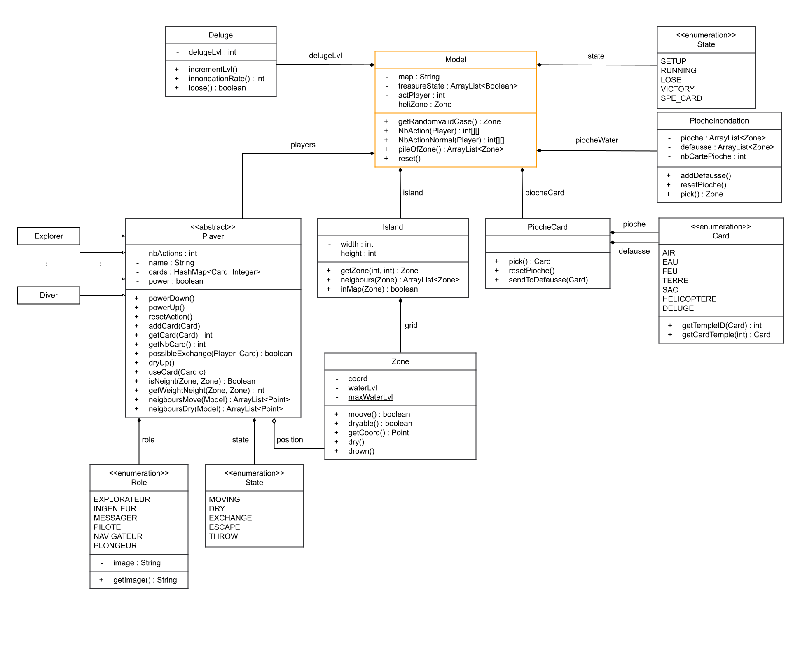

<h1 align="center">
   
  
   

  
 ♟ Forbiden Island ♟ 

</h1>

# Interface

## Setup

## Game

## Rules

[rules](rules.pdf)

## Win

To win you must have collected all the temples and use the 
helicopter card when everyone is on the heliport space

## Lose

You lose if :
  - A temple sinks and this key has not been recovered
  - If a player sinks and cannot recover on a space next to
  - If the helipad sinks

## Get Forbiden Island

#### Required libs and tools:
  - Java
  - Swing
  - Junit (for tests)

## UML

### MVC

### Models

### Controllers

### Views

